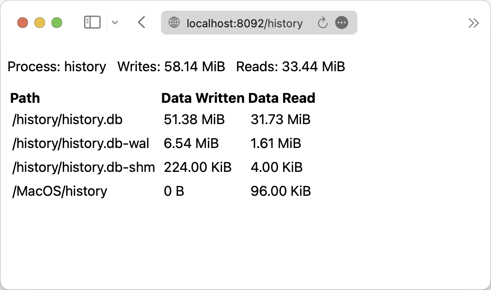

# iosnoopng

Monitor disk activity on your Mac. Like iosnoop but with a Web GUI, intended to be run as a daemon.

How is it different from the Disk tab of Activity Monitor? Activity Monitor can only show process that are currently running. However, iosnoopng can collect metrics from **transient processes** that are not shown in Activity Monitor (i.e. process that is not long-running, like your C compilers). It can also show the read and write bytes of each process to each file.

## Screenshots

You can view the total write and read bytes of each process.


And the read and write bytes of each process to each file.



## Build

Make sure you have Node.js and Go installed.

```bash
npm i
make
```

## Prerequisites (macOS)

1. Disable SIP (System Integrity Protection) by booting into recovery mode and running `csrutil disable`.

## Usage (macOS)

> [!WARNING]
> **Make sure your Mac has NOT slept since last boot**, otherwise you will certainly have a system freeze. If you are not sure, reboot your Mac now. Otherwise, save your work and be prepared for a system freeze if it happens.
> 
> This tool uses dtrace internally. Due to an issue the darwin kernel, if your Mac has slept since the last boot, running dtrace may cause a system freeze. This is an issue with the darwin kernel and I have no control over it. See [this](https://forums.developer.apple.com/forums/thread/735939) .
> 

```bash
sudo ./iosnoopng
```

By default, the server will listen on `http://localhost:8092`. You can use launchd or other tools to run this as a daemon.

Command line options:
- `-a`: Listen address (default "127.0.0.1:8092")
- `-l`: Log level (default "info")
- `-o`: Save raw dtrace output to a file (default "")

> [!WARNING]
> Before quitting iosnoopng, **make sure your Mac have NOT slept**, due to the same reason mentioned above. If your Mac has not slept, you can safely quit iosnoopng. However, if your Mac has slept, quitting iosnoopng may cause a system freeze. Either let iosnoopng running or save your work and **force** reboot your Mac.

## Extra Considerations

- Since iosnoopng records paths of files, its memory usage may grow over time.
